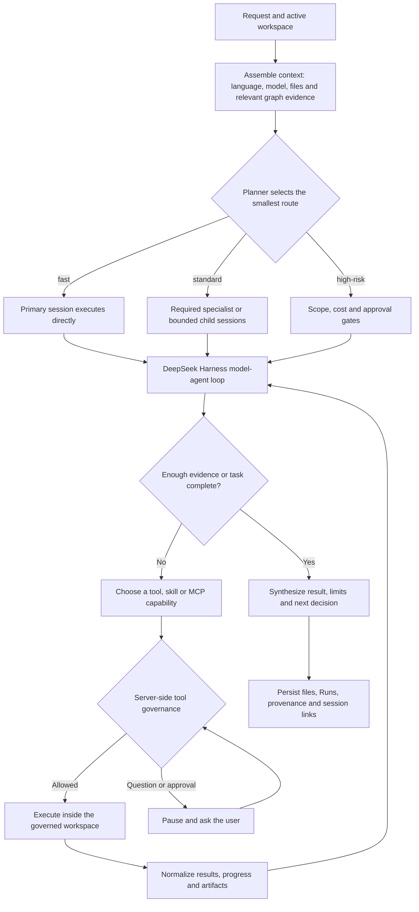
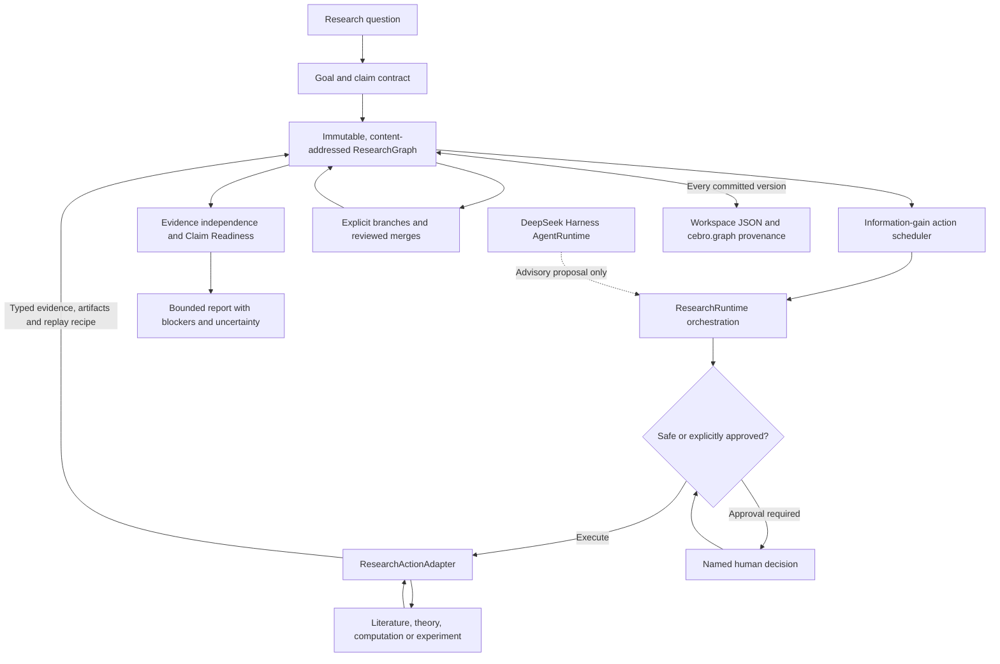

<div align="center">


# NebulaMat

**A local-first AI research workbench for materials discovery and reproducible science.**

NebulaMat brings agent conversations, scientific files, notebooks, knowledge graphs,
materials workflows, compute runs, and provenance into one inspectable desktop workspace.

<p>
  <b>English</b> · <a href="./README.zh.md">简体中文</a>
</p>

<p>
  <a href="https://github.com/Tai609/NebulaMat/releases/latest"></a>
  <a href="./LICENSE"></a>
  
  
  
</p>

</div>

> [!IMPORTANT]
> NebulaMat is beta research software. Treat generated structures, energies,
> citations, figures, and conclusions as drafts until they have passed the
> appropriate computational or human review.

<p align="center">
  <a href="#design-philosophy">Design</a> ·
  <a href="#agent-orchestration">Agents</a> ·
  <a href="#cebro-evidence-kernel">CEBRO</a> ·
  <a href="#core-workflows">Workflows</a> ·
  <a href="#complete-architecture">Architecture</a> ·
  <a href="#install">Install</a>
</p>

## Why NebulaMat

Most agent interfaces stop at a chat response. NebulaMat is built around the work
that follows: files, calculations, evidence, review, and reproducibility. Its central
design separates four responsibilities that are often collapsed into one model turn:

| Layer | Owns | Boundary |
| --- | --- | --- |
| **DeepSeek Harness** | Sessions, models, the agent loop, tools, skills, and MCP dispatch. | Executes work; it does not decide whether a scientific claim is ready. |
| **CEBRO** | Claim contracts, branchable research state, evidence independence, action lifecycle, and readiness. | Governs evidence; it does not own model transport or domain execution. |
| **Scientific modules** | Literature retrieval, materials generation, ML screening, DFT preparation, and other typed adapters. | Produce evidence and artifacts under domain-specific validation rules. |
| **Tauri workspace host** | Local files, Runs, provenance, approvals, credentials, gateways, and sidecar lifecycle. | Owns durable state and operating-system capabilities. |

## Design Philosophy

NebulaMat is not designed to make AI sound certain. It is designed to make research
decisions inspectable, reproducible, and falsifiable.

| Principle | Design consequence |
| --- | --- |
| **Research is a graph, not a transcript.** | Claims, hypotheses, actions, evidence, artifacts, counter-evidence, failures, and branch merges remain explicit and traceable. |
| **Agents propose; evidence decides.** | A model may suggest a hypothesis or falsifier, but cannot mark its own claim supported or conceal a missing evidence requirement. |
| **Use the lowest-cost discriminating step.** | Generation and ML proxies narrow the search space; fidelity increases only when the question justifies higher-cost computation or experiment. |
| **Local state is the source of truth.** | Workspaces, graph versions, Runs, and provenance live locally by default; a conversation is a view of that state, not the state itself. |
| **Intelligence is replaceable; governance is stable.** | Models, providers, skills, MCP servers, and adapters can change without bypassing `AgentRuntime`, approvals, or scientific contracts. |
| **Human authority increases with risk.** | Paid, remote, destructive, or claim-critical actions require stronger review and, where required, approval bound to exact input hashes. |
| **Reproducibility is an output.** | A valuable run retains inputs, code, environment, model identity, hashes, artifacts, decisions, and uncertainty, not only prose. |

## Agent Orchestration

NebulaMat does not force every request through a fixed multi-agent graph. `planner` is
the default coordinator: it classifies intent, evidence needs, cost, and risk, then
chooses the smallest route that can answer the question. Delegation is an optimization,
not an entrance requirement; the primary session handles straightforward work itself.

### Route before delegation

| Route | Composition | Required gates |
| --- | --- | --- |
| `fast` | Primary session only; no child agent, reviewer, or DAG. | Normal workspace and tool rules. |
| `standard` | `planner` plus only the required specialist. Independent work may use bounded child sessions, followed by one compact synthesis. | Explicit task bounds, acceptance criteria, and provenance for produced artifacts. |
| `high-risk` | `planner` plus the required `compute` or `experiment` role and a targeted `reviewer` when justified. | Scope and cost audit, durable provenance, and explicit human approval before remote, paid, destructive, or claim-critical actions. |

Role names describe stable ownership, not agents that must always run: `planner` owns
routing, budget, and synthesis; `materials` owns structures and ML screening;
`literature` owns retrieval and evidence links; `compute` owns DFT and remote plans;
`experiment` owns laboratory protocols; and `reviewer` performs independent, targeted
checks. A child agent is an isolated, parent-linked session and is created only when the
work is independently bounded or genuinely benefits from parallel execution.

### A run, end to end



The runtime model has four guarantees:

- **State-bound execution:** every turn is attached to an isolated session, active
  workspace, selected model and reasoning effort, response language, and optional
  parent session.
- **Minimal orchestration:** DeepSeek Harness loops over only the context and capabilities
  required for the task; child sessions are bounded and remain visibly linked to their
  parent.
- **Governed side effects:** server-side admission runs before governed tool bodies.
  Questions and approvals pause the turn; remote or DFT execution requires hash-bound,
  named human approval.
- **Observable, durable completion:** normalized events support progress, steering, and
  abort. Tool results become files, Runs, and provenance, while evidence gaps remain
  visible instead of being replaced with fluent prose.

## CEBRO Evidence Kernel

**CEBRO** (Causal-Evidence Branching Research OS) is NebulaMat's discipline-neutral
research state and evidence-governance layer. It is deliberately separate from the
agent runtime: DSH can reason and call tools, while CEBRO determines how claims,
hypotheses, actions, evidence, artifacts, and uncertainty may change research state.

### Kernel architecture



### Typed research state

| Node | Purpose |
| --- | --- |
| **Claim** | A scoped statement with required evidence, falsifiers, minimum coverage, epistemic level, independence, and challenge requirements. |
| **Hypothesis** | A competing explanation with alternatives and an optional versioned belief state. |
| **Action** | A retrieval, observation, computation, derivation, simulation, challenge, or synthesis step with expected gain, cost, risk, and reversibility. |
| **Evidence** | A source- or artifact-linked record that `supports`, `refutes`, `qualifies`, or remains `inconclusive`, with strength and uncertainty. |
| **Artifact** | Data, code, figures, reports, notebooks, or models with content hashes and replay information. |
| **Counterfactual** | A testable alternative premise with a predicted observation and explicit falsifier. |

CEBRO enforces several rules that model prose cannot override:

- Claim requirements exist before report compilation. Readiness checks evidence
  coverage, challenge status, epistemic level, and independent evidence groups.
- Candidate actions are ranked by expected information and confidence gain per cost,
  with explicit penalties for risk and irreversibility.
- Branches never share evidence implicitly. A merge is a durable event, and only
  reviewed outputs are promoted. Failed and inconclusive actions remain in the graph.
- A `ResearchActionAdapter` returns status, evidence, artifacts, and an optional replay
  recipe; it cannot mutate the graph or declare a claim supported by itself.
- External-effect and irreversible actions remain proposed until a named human approves
  them. Reports expose blockers and diagnostics rather than upgrading uncertainty.

### Deep Research lifecycle

Conversation-scoped Deep Research uses the same evidence discipline through a
host-enforced six-stage state machine:

`inspect -> hypothesize -> plan -> execute -> evaluate -> synthesize`

Agent proposals carry a strict schema and the graph hash used to prepare the turn.
Stale revisions and invalid stage transitions are rejected. Model-authored evidence is
limited to qualifying or inconclusive interpretation; adapter and tool receipts provide
execution evidence. Literature synthesis requires governed retrieval and successful
coverage from at least two independent external providers, otherwise the result is
released as incomplete with explicit blockers.

Each committed graph is stored under `.openscience/research/<researchId>.json` in the
active workspace and recorded as an idempotent `cebro.graph` provenance version. The v2
kernel, workspace persistence, and conversation orchestration are implemented; broader
theory, computation, experiment, and structured-argument adapters remain an open
extension surface.

Implementation references: [CEBRO kernel](./packages/shared/src/research.ts),
[ResearchRuntime](./packages/sdk/src/researchRuntime.ts), and the
[architecture RFC](./docs/rfc/cebro-research-os.md).

## Core Workflows

### Work in a complete research workspace

- Keep related sessions in named projects and inspect the files each session creates.
- Use notebooks, reports, tables, structures, trajectories, and office documents in
  the same desktop application.
- Track local and remote runs instead of relying on terminal scrollback.
- Restore long-running work from history, project memory, and workspace-local state.
- Use split panes to compare models, sessions, evidence, or artifacts side by side.

### Explore literature and structured knowledge

- Connect literature, biomedical, materials, economic, weather, and other data sources
  through MCP.
- Build a persistent knowledge index and retrieve graph-shaped evidence for ordinary
  model conversations.
- Explore article-level nodes and relations in the Knowledge Universe without loading
  an entire corpus into the UI at once.
- Organize claims, evidence, actions, and decisions in a branchable research graph.

### Choose a research lane

The composer exposes three related but distinct lanes through one expandable research
menu:

- **Deep Research** runs the evidence-gated literature and reasoning lifecycle.
- **Scientific Assistant** classifies a computational task, selects only the matching
  scientific tool family, checks runtime readiness, and records why nearby tools were
  excluded.
- **Experiment Record** normalizes uploaded laboratory notes without inventing missing
  values or modifying the archived raw evidence.

Selecting a lane never grants submission approval. Remote, paid, or high-cost
calculations still stop after input validation and cost review until the user approves
the exact run.

### Route scientific work by task

Scientific Assistant uses a capability-based routing contract rather than a fixed
pipeline:

| Task | Preferred tool family | Selection boundary |
| --- | --- | --- |
| Periodic DFT | VASP or CP2K | Choose the engine from the requested method, licensed environment, pseudopotentials, and required observables; do not silently substitute one engine for another. |
| Molecular quantum chemistry | Gaussian and Multiwfn | Gaussian owns the calculation; Multiwfn analyzes a validated wavefunction and does not replace the quantum-chemistry engine. |
| Molecular and classical dynamics | LAMMPS or GROMACS | Select from the physical system, topology, force field, ensemble, and target observables. |
| Machine-learning potentials | MatterSim, UMA, DeePMD, or general MLP workflows | Preserve model identity and training domain; never mix energies from different models in one physical expression. |
| Structure construction | pymatgen, ASE, RDKit, or CatKit | Use periodic, molecular, and adsorption-site builders according to the structure type and retain an edit manifest. |
| Phonons and thermochemistry | Phonopy or VASPKIT | Require a concrete vibrational, free-energy, DOS/PDOS, work-function, or trajectory deliverable. |
| Catalytic kinetics | CatMAP, Cantera, OpenMKM, or kmos | Distinguish mean-field microkinetics, reactor validation, and spatial lattice kinetics. |
| Electronic-structure post-processing | LOBSTER, Bader, or VASPKIT | Run only on compatible, converged upstream outputs and report the observable each result can support. |
| Visualization | VASPFlow scene, OVITO, PyVista, or VMD | Use VASPFlow for VASP task inspection, OVITO for atomistic/trajectory renders, PyVista for volumetric fields, and VMD for molecular trajectories. |

MatterGen remains an optional upstream route for candidate generation. Before any tool
runs, the assistant reports `configured`, `discovered`, `ready`, and `missing`
separately: a bundled skill or reference document is not proof that an external
binary, model weight, license, basis set, force field, or cluster module is ready.

### Run governed materials workflows

NebulaMat provides a modular path for materials discovery rather than a single opaque
"predict" button:

```text
MatterGen proposal
        |
controlled bulk / surface standardization
        |
MatterSim bulk proxy ---- UMA adsorption and surface MD
        |                         |
        +---------- evidence and review ----------+
                                      |
                             VASP validation gate
                                      |
                            experimental follow-up
```

- **MatterGen** proposes crystal structures and records request parameters, generated
  CIFs, hashes, and run manifests.
- **MatterSim** can provide first-pass bulk energy, force, stress, and relaxation
  proxies.
- **UMA** supports same-model adsorption screening and governed ASE surface molecular
  dynamics with auditable trajectories.
- **VASP/DFT** preparation includes model and cost auditing, immutable input hashes,
  and named human approval before any remote submission.
- The native **VASP Assistant** scans VASP task trees, convergence histories, and task
  files through the bundled VASPFlow Host service.
- CIF, POSCAR, CONTCAR, Materials Project structures, and trajectories use the shared
  VASPFlow scene contract and Three.js renderer, including explicit periodic image
  atoms for cross-boundary bonds.

The workflow is capability based: stages can be skipped, branched, or replaced when
the scientific question does not require them.

### Normalize and manage experiment records

The left sidebar includes a local **Experiment Database** for laboratory evidence:

- Upload notes, images, audio, tables, and instrument exports into an immutable raw
  archive under the active workspace.
- Assign stable experiment IDs, edit structured metadata, search records, and archive
  or restore catalog entries without deleting the raw attachments.
- Send a record to Experiment Record mode to produce a YAML-frontmatter Markdown log
  plus a fixed-path JSON receipt that can be synchronized back into the database.
- Keep source facts, interpretation, anomalies, and missing fields separate. Missing
  temperatures, units, sample identifiers, instruments, or outcomes are never guessed.

## Scientific Boundaries

These limits are part of the product contract:

- MatterGen samples candidates; it does not establish thermodynamic stability or
  synthesizability.
- MatterSim is primarily a bulk-material proxy. Surface results remain qualitative
  until calibrated against a higher-fidelity method.
- UMA adsorption energies are same-model descriptors, not complete activity,
  selectivity, solvent, pH, potential, or free-energy predictions.
- MatterSim and UMA energies must not be mixed in one adsorption-energy expression.
- VASP is an external licensed program and is never bundled with NebulaMat.
- Bundled AICC skills provide procedures and validation helpers, not CP2K, Gaussian,
  LAMMPS, GROMACS, VASP, commercial licenses, model weights, basis sets, or force fields.
- Removing an experiment catalog entry does not delete its raw evidence or normalized
  Markdown log.
- Language-model output is not evidence by itself. Claims should remain linked to
  source data, calculations, literature, or explicit human judgment.

## Complete Architecture

```mermaid
flowchart TB
    subgraph access["Access surfaces"]
        desktop["Tauri desktop WebView"]
        remote["Authenticated browser or phone"]
    end

    subgraph frontend["React application"]
        ui["Routes and research workspaces"]
        artifacts["Files, viewers, notebooks and Runs"]
        orchestrator["Session and task orchestration"]
        prompt["Unified prompt preparation"]
        sdk["AgentRuntime and DeepSeekHarnessClient"]
    end

    subgraph cebro["CEBRO evidence layer"]
        researchRuntime["ResearchRuntime orchestration"]
        researchGraph["Immutable ResearchGraph"]
        scheduler["Information-gain action scheduler"]
        adapters["ResearchActionAdapter boundary"]
        readiness["Evidence independence and Claim Readiness"]
    end

    subgraph native["Tauri native host"]
        ipc["Tauri command bridge"]
        desktopBridge["App-private desktop bridge"]
        remoteGateway["Token-authenticated remote gateway"]
        supervisor["DSH and sidecar supervisor"]
        workspaceSvc["Workspace, projects and Git snapshots"]
        durableSvc["Runs, provenance and research store"]
        knowledgeSvc["MAGE-Graph knowledge-base service"]
        executionSvc["Jupyter, browser and remote compute"]
    end

    subgraph harness["DeepSeek Harness runtime"]
        dshHost["DSH Host and agent loop"]
        sessions["Sessions, models and normalized events"]
        toolset["Tools, skills and MCP client"]
        governance["Server-side tool governance"]
        extensions["GenUI and cost meter"]
    end

    subgraph science["Scientific and research modules"]
        aris["ARIS research skills"]
        connectors["Science MCP connectors"]
        materials["Materials MCP orchestrator"]
        mattergen["MatterGen generation"]
        mattersim["MatterSim bulk screening"]
        uma["UMA adsorption and surface MD"]
        dft["DFT audit and human approval"]
    end

    subgraph storage["Local durable state"]
        workspace[(Workspace files and session folders)]
        researchStore[(CEBRO graphs, Runs and provenance)]
        knowledgeStore[(MAGE-Graph corpus and SQLite FTS5 graph index)]
        privateState[(App-private DSH_HOME, settings and credentials)]
        checkpoints[(Scientific models and checkpoints)]
    end

    subgraph external["Optional external systems"]
        providers["Model providers"]
        dataApis["Literature and scientific APIs"]
        chrome["Chrome or isolated browser"]
        python["Native or WSL2 Python and GPU"]
        compute["SSH, Slurm and Modal"]
        vasp["Licensed VASP installation"]
    end

    desktop -->|"Desktop UI"| ui
    remote -->|"Gateway-served UI"| ui
    ui --> artifacts
    ui --> orchestrator
    ui --> researchRuntime
    artifacts -->|"Native file and kernel calls"| ipc
    orchestrator --> prompt
    researchRuntime -->|"Advisory model turns"| prompt
    researchRuntime -->|"Persist graph versions"| ipc
    researchRuntime --> researchGraph
    researchGraph --> scheduler
    scheduler --> researchRuntime
    researchRuntime --> adapters
    adapters --> researchGraph
    researchGraph --> readiness
    readiness --> ui
    prompt --> sdk
    orchestrator -->|"Native capabilities"| ipc

    sdk <-->|"Desktop HTTP and WebSocket"| desktopBridge
    sdk <-->|"Remote HTTP and WebSocket"| remoteGateway
    desktopBridge <-->|"Authenticated loopback proxy"| dshHost
    remoteGateway <-->|"Bearer-token proxy"| dshHost
    ipc --> supervisor
    supervisor -->|"Launch and monitor"| dshHost

    dshHost --> sessions
    dshHost --> toolset
    dshHost --> governance
    dshHost --> extensions
    toolset --> aris
    toolset --> connectors
    toolset --> materials
    adapters --> connectors
    adapters --> materials
    governance -->|"Gate high-risk execution"| dft

    ipc --> workspaceSvc
    ipc --> durableSvc
    ipc --> knowledgeSvc
    ipc --> executionSvc
    workspaceSvc --> workspace
    durableSvc --> researchStore
    knowledgeSvc --> knowledgeStore
    knowledgeSvc -->|"Graph and document evidence"| prompt
    supervisor --> privateState
    dshHost --> privateState
    toolset -->|"Read and write artifacts"| workspace

    materials --> mattergen
    materials --> mattersim
    materials --> uma
    materials --> dft
    checkpoints --> mattergen
    checkpoints --> mattersim
    checkpoints --> uma

    sessions -.->|"Model requests"| providers
    connectors -.->|"Source queries"| dataApis
    executionSvc -.->|"Browser control"| chrome
    executionSvc -.->|"Local scientific execution"| python
    executionSvc -.->|"Remote jobs"| compute
    mattergen -.->|"Generation runtime"| python
    mattersim -.->|"Screening runtime"| python
    uma -.->|"GPU screening and MD"| python
    dft -.->|"Approved submission"| compute
    dft -.->|"Licensed solver"| vasp

    classDef accessNode fill:#f3f4f6,stroke:#4b5563,color:#111827;
    classDef frontendNode fill:#e8f1ff,stroke:#2563eb,color:#172554;
    classDef researchNode fill:#eaf7f4,stroke:#28796a,color:#143d35;
    classDef nativeNode fill:#e8f7ef,stroke:#16815d,color:#12372a;
    classDef runtimeNode fill:#f0eaff,stroke:#7357c7,color:#2e1a64;
    classDef scienceNode fill:#fff4da,stroke:#b7791f,color:#4a2c00;
    classDef storeNode fill:#f4f1ec,stroke:#6b6257,color:#292524;
    classDef externalNode fill:#fff0ee,stroke:#c25a4a,color:#54211a;

    class desktop,remote accessNode;
    class ui,artifacts,orchestrator,prompt,sdk frontendNode;
    class researchRuntime,researchGraph,scheduler,adapters,readiness researchNode;
    class ipc,desktopBridge,remoteGateway,supervisor,workspaceSvc,durableSvc,knowledgeSvc,executionSvc nativeNode;
    class dshHost,sessions,toolset,governance,extensions runtimeNode;
    class aris,connectors,materials,mattergen,mattersim,uma,dft scienceNode;
    class workspace,researchStore,knowledgeStore,privateState,checkpoints storeNode;
    class providers,dataApis,chrome,python,compute,vasp externalNode;
```



The diagram separates ownership as well as call flow:

- The React application owns presentation and orchestration, but reaches the agent
  loop only through `AgentRuntime` in `packages/sdk`.
- The Tauri host owns OS capabilities, workspace boundaries, durable local state,
  authenticated gateways, and sidecar lifecycle.
- DeepSeek Harness owns sessions, models, the agent loop, tools, skills, MCP dispatch,
  and the authoritative server-side execution gate.
- CEBRO owns claim contracts, branch semantics, action lifecycle, evidence independence,
  and readiness. It may request agent proposals, but only validated graph transactions
  and adapter outputs can change research state.
- Scientific modules remain above the runtime boundary and return typed evidence,
  artifacts, and replay metadata through their own validation contracts.
- Solid arrows are local application or proxy flows. Dotted arrows cross into optional
  model, data, browser, Python/GPU, remote-compute, or licensed-solver environments.

## Install

Download a package from [NebulaMat GitHub Releases](https://github.com/Tai609/NebulaMat/releases/latest).

| Platform | Current project status |
| --- | --- |
| Windows 10/11 x64 | Primary verified NebulaMat build target. The NSIS installer is currently unsigned, so SmartScreen may require **More info -> Run anyway**. |
| macOS 13+ | Tauri packaging is configured for Apple Silicon and Intel. Check the release notes for the validation and signing status of a specific package. |
| Linux x86_64 | `.deb` and `.rpm` targets are configured. Check the release notes for the validation status of a specific package. |

You will need credentials for at least one supported model provider. They are stored in
the application-private runtime configuration rather than in a workspace or Git repo.

### Optional scientific components

Large scientific dependencies are deliberately separated from ordinary source code:

- MatterGen source can ship with the application, but model checkpoints are installed
  and verified separately.
- UMA and MatterSim checkpoints are not ordinary Git objects and should be distributed
  through a model or release-asset workflow.
- A full MAGE-Graph knowledge corpus may be packaged as a release resource or imported by
  the user; it is not required to understand or build the application source.
- VASP, cluster credentials, API keys, and private research data are never included.

## Build From Source

Prerequisites:

- Node.js 20 or newer
- pnpm 9.4.0
- Rust stable and the platform dependencies required by Tauri 2
- On Windows: Visual Studio Build Tools with the MSVC and Windows SDK components
- Git LFS only if you intentionally work with LFS-managed scientific assets

```bash
git clone https://github.com/Tai609/NebulaMat.git
cd NebulaMat
corepack enable
corepack prepare pnpm@9.4.0 --activate
pnpm install
```

Windows development uses the pinned bundled Node.js and DeepSeek Harness closure:

```powershell
powershell.exe -NoProfile -ExecutionPolicy Bypass -File scripts/release/prepare-bundled-dsh.ps1
pnpm --filter @ai4s/desktop tauri dev
```

For macOS or Linux development, install the pinned DSH version or point
`NEBULAMAT_DSH_BIN` at a compatible executable:

```bash
npm install --global @deepseek-ai/dsh@0.1.0-rc.6
pnpm --filter @ai4s/desktop tauri dev
```

Build and check the desktop application:

```bash
pnpm build
pnpm test
pnpm typecheck
pnpm lint
pnpm --filter @ai4s/desktop tauri build
```

## Privacy and Safety

- Local first does not mean air-gapped: the selected model provider receives the
  context required for a model turn, and enabled MCP or remote-compute services receive
  the requests you send to them.
- API keys belong in the OS credential store or application-private provider config,
  never in source files, prompts, logs, provenance, or exported artifacts.
- Command execution, dependency installation, deletion, and remote connections use
  explicit product approval flows.
- Remote DFT submission requires a model/cost audit and named human approval tied to
  the exact input hashes.

## Repository Layout

| Path | Purpose |
| --- | --- |
| `apps/desktop/` | React frontend and Tauri desktop application. |
| `packages/sdk/` | Runtime-neutral `AgentRuntime`, DSH adapter, and CEBRO `ResearchRuntime` orchestration. |
| `packages/shared/` | CEBRO graph kernel plus shared scientific and application contracts. |
| `runtime/harness/` | Replaceable DSH composition and NebulaMat runtime modules. |
| `runtime/harness/dsh-vaspflow/` | Bundled VASPFlow Host scanner, parser, task-file, and structure-scene service. |
| `runtime/aicc/` | Pinned computational-chemistry skills, validation helpers, and scientific references. |
| `runtime/materials-mcp/` | Materials validation, screening, and workflow tools. |
| `runtime/mattergen/` | MatterGen adapter, setup, and provenance-aware runner. |
| `runtime/aris/` | Pinned Auto-Research-In-Sleep skill pack integration. |
| `materials/runtime.json` | Versioned machine-readable scientific defaults. |
| `docs/rfc/` | Implemented architecture decisions, including the CEBRO and runtime boundaries. |
| `scripts/` | Development, synchronization, and release tooling. |
| `PROGRESS.md` | Evidence-oriented implementation and verification log. |

## Project Status

NebulaMat is under active development. Windows x64 is the most frequently exercised
release path in the current source tree. Cross-platform manifests exist, but every
published package should be judged by its own release notes and validation evidence.

The source manifests currently identify version `1.0.7`. Release tags and translations
may lag behind the active development tree.

## Contributing

Issues and pull requests are welcome. Keep scientific claims traceable, preserve the
runtime/module boundary, and include focused tests proportional to the change. Start
with [`AGENTS.md`](./AGENTS.md) and the relevant runtime README.

Before opening a pull request:

```bash
pnpm test
pnpm typecheck
pnpm lint
```

Do not commit session workspaces, credentials, local runtime state, generated build
directories, proprietary binaries, or multi-gigabyte model checkpoints.

## License

NebulaMat source code is licensed under the [MIT License](./LICENSE). Bundled or
adapted third-party models, datasets, skills, and connectors retain their own terms;
see [`THIRD_PARTY_NOTICES.md`](./THIRD_PARTY_NOTICES.md).
