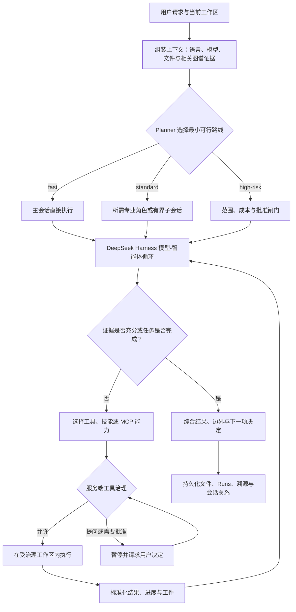
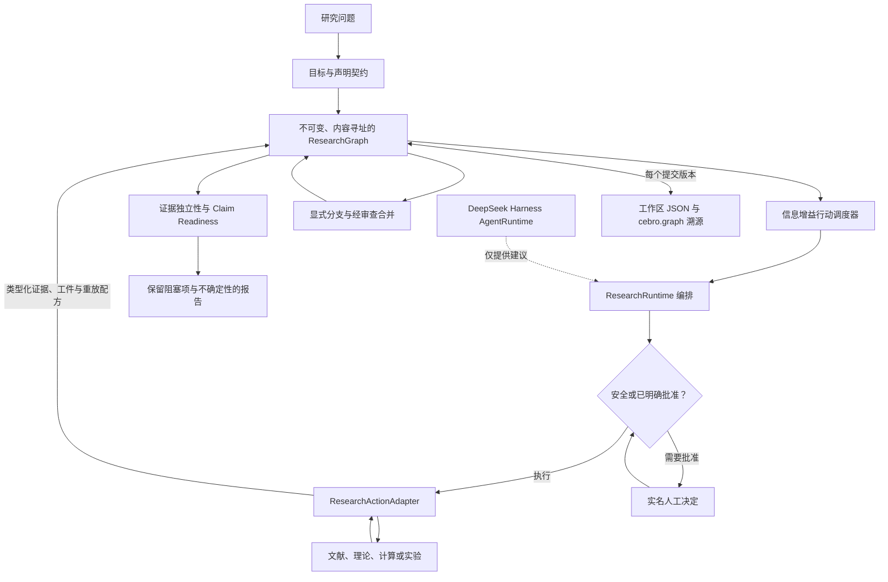

<div align="center">


# NebulaMat

**面向材料发现与可复现科研的本地优先 AI 桌面工作台。**

NebulaMat 把智能体对话、科研文件、Notebook、知识图谱、材料计算流程、运行记录和
数据溯源放进同一个可检查的桌面工作区。

<p>
  <a href="./README.md">English</a> · <b>简体中文</b>
</p>

<p>
  <a href="https://github.com/Tai609/NebulaMat/releases/latest"></a>
  <a href="./LICENSE"></a>
  
  
  
</p>

</div>

> [!IMPORTANT]
> NebulaMat 仍是 beta 阶段科研软件。生成的结构、能量、引用、图表和结论都应视为
> 草稿，必须经过相应的计算验证或人工审查后才能用于发表和决策。

<p align="center">
  <a href="#设计哲学">设计哲学</a> ·
  <a href="#agent-编排">Agent 编排</a> ·
  <a href="#cebro-证据内核">CEBRO</a> ·
  <a href="#核心工作流">工作流</a> ·
  <a href="#完整架构">架构</a> ·
  <a href="#安装">安装</a>
</p>

## 为什么做 NebulaMat

多数智能体界面停在一次聊天回复。NebulaMat 更关注回复之后的科研工作：文件、计算、
证据、审查和可复现性。它把通常被挤进一次模型调用的职责拆成四个清晰层次：

| 层次 | 负责什么 | 明确边界 |
| --- | --- | --- |
| **DeepSeek Harness** | 会话、模型、智能体循环、工具、技能与 MCP 调度。 | 负责执行，但不判断科学声明是否已经就绪。 |
| **CEBRO** | 声明契约、可分支研究状态、证据独立性、行动生命周期与就绪度。 | 负责证据治理，但不拥有模型传输或具体学科执行。 |
| **科学模块** | 文献检索、材料生成、机器学习筛选、DFT 准备及其他类型化适配器。 | 按学科验证规则产生证据和工件。 |
| **Tauri 工作区宿主** | 本地文件、Runs、溯源、审批、凭据、网关和 sidecar 生命周期。 | 负责持久状态与操作系统能力。 |

## 设计哲学

NebulaMat 的目标不是让 AI 显得更确定，而是让科研决策可检查、可复现、可证伪。

| 原则 | 对应的设计结果 |
| --- | --- |
| **研究是图谱，不是聊天记录。** | 声明、假设、行动、证据、工件、反证、失败结果和分支合并都保持明确且可追踪。 |
| **智能体负责提出，证据负责裁决。** | 模型可以建议假设和证伪条件，但不能自行把声明标记为已证实，也不能隐藏缺失的证据要求。 |
| **优先执行成本最低、区分力足够的步骤。** | 生成模型和机器学习代理量用于缩小空间；只有问题确实需要时才升级到高成本计算或实验。 |
| **本地状态才是事实来源。** | 工作区、图谱版本、Runs 与溯源默认保存在本机；对话只是状态视图，不是状态本身。 |
| **智能层可以替换，治理层必须稳定。** | 模型、提供方、技能、MCP 和适配器可以替换，但不能绕过 `AgentRuntime`、审批或科学契约。 |
| **风险越高，人的决定权越强。** | 付费、远程、破坏性或影响关键声明的操作需要更强审查，并在需要时绑定确切输入哈希批准。 |
| **可复现性本身就是一种产出。** | 有价值的运行会保留输入、代码、环境、模型身份、哈希、工件、决策和不确定性，而不只是文字。 |

## Agent 编排

NebulaMat 不会让所有请求强制经过固定的多智能体 DAG。`planner` 是默认协调器：它先判断
意图、证据需求、成本和风险，再选择能够回答问题的最小路线。委派是一种优化手段，而不是
必经入口；直接、明确的工作由主会话自行完成。

### 先选路线，再决定是否委派

| 路线 | 编排方式 | 必要闸门 |
| --- | --- | --- |
| `fast` | 仅主会话执行；不创建子智能体、不调用 reviewer，也不构造 DAG。 | 常规工作区与工具规则。 |
| `standard` | `planner` 只启用所需专业角色；彼此独立的工作可进入有界子会话，最后只做一次紧凑综合。 | 明确任务边界、验收条件，并为生成工件保留溯源。 |
| `high-risk` | `planner` 按需加入 `compute` 或 `experiment`，并在确有必要时进行定向 `reviewer` 审查。 | 范围与成本审计、持久溯源，以及远程、付费、破坏性或影响关键声明的操作前人工批准。 |

角色名称表示稳定职责，并不意味着每次都要启动全部智能体：`planner` 负责路由、预算和最终
综合；`materials` 负责结构与机器学习筛选；`literature` 负责检索和证据链接；`compute`
负责 DFT 与远程计算计划；`experiment` 负责实验方案；`reviewer` 只做独立、定向的审查。
子智能体对应与父会话持久关联的隔离会话，只在任务边界独立或确实适合并行时创建。

### 一次运行如何完成



这个运行模型提供四项保证：

- **状态绑定：** 每个回合都绑定到隔离会话、当前工作区、所选模型与推理强度、回复语言，
  委派任务还会绑定父会话。
- **最小编排：** DeepSeek Harness 只循环使用任务需要的上下文和能力；子会话保持有界，并
  始终与父会话建立可见关联。
- **副作用治理：** 服务端准入在受治理工具真正执行前运行。提问和审批会暂停回合；远程或
  DFT 执行需要绑定哈希的实名人工批准。
- **可观察、可持久完成：** 标准化事件支持进度展示、运行中调整和中止。工具结果进入文件、
  Runs 与溯源，证据缺口不会被流畅文字掩盖。

## CEBRO 证据内核

**CEBRO**（Causal-Evidence Branching Research OS）是 NebulaMat 与学科无关的研究状态和
证据治理层。它与智能体运行时刻意分离：DSH 负责推理和调用工具，CEBRO 决定声明、假设、
行动、证据、工件和不确定性能够如何改变研究状态。

### 内核架构



### 类型化研究状态

| 节点 | 用途 |
| --- | --- |
| **Claim** | 带范围、所需证据、证伪条件、最低覆盖率、认识论等级、独立性和挑战要求的声明。 |
| **Hypothesis** | 带备选解释以及可选版本化置信状态的竞争假设。 |
| **Action** | 带预期增益、成本、风险和可逆性的检索、观测、计算、推导、模拟、挑战或综合步骤。 |
| **Evidence** | 关联来源或工件的记录，可以支持、反驳、限定声明，或保持不确定，并保留强度与不确定性。 |
| **Artifact** | 带内容哈希与重放信息的数据、代码、图表、报告、Notebook 或模型。 |
| **Counterfactual** | 带预测观测和明确证伪条件、可被检验的替代前提。 |

CEBRO 强制执行以下不能被模型文字覆盖的规则：

- 在编译报告前先定义声明要求；就绪度检查证据覆盖、挑战状态、认识论等级和独立证据组。
- 候选行动按单位成本带来的预期信息增益和置信增益排序，并显式惩罚风险与不可逆性。
- 分支不会隐式共享证据；合并是持久事件，只提升经过审查的输出。失败和不确定行动不会被删除。
- `ResearchActionAdapter` 只能返回状态、证据、工件和可选重放配方，不能直接修改图或自行宣布
  声明成立。
- 具有外部影响或不可逆的行动必须保持 proposed，直到取得实名人工批准；报告会暴露阻塞项
  和诊断信息，而不是自动提升结论确定性。

### Deep Research 生命周期

会话级 Deep Research 通过宿主强制的六阶段状态机使用同一套证据纪律：

`inspect -> hypothesize -> plan -> execute -> evaluate -> synthesize`

Agent 提案必须携带严格 Schema 和准备该回合时的图哈希；过期版本和非法阶段跳转会被拒绝。
模型生成的证据只能用于限定或保持不确定，适配器与工具回执才构成执行证据。文献综合必须通过
受治理检索，并成功覆盖至少两个独立外部来源；否则只会发布带明确阻塞项的不完整结果。

每个提交后的图都保存在当前工作区的 `.openscience/research/<researchId>.json`，并记录为幂等
的 `cebro.graph` 溯源版本。v2 内核、工作区持久化和会话编排已经实现；理论、计算、实验和
结构化论证等更广泛适配器仍保留为开放扩展面。

实现入口：[CEBRO 内核](./packages/shared/src/research.ts)、
[ResearchRuntime](./packages/sdk/src/researchRuntime.ts) 与
[架构 RFC](./docs/rfc/cebro-research-os.md)。

## 核心工作流

### 完整科研工作区

- 用命名项目组织相关会话，并直接检查每次会话创建的文件。
- 在同一桌面应用中查看 Notebook、报告、表格、晶体结构、轨迹和 Office 文档。
- 记录本地及远程计算任务，避免只留下难以复现的终端滚屏。
- 通过历史记录、项目记忆和工作区状态恢复长周期科研任务。
- 用分屏并排比较模型、会话、证据和工件。

### 文献与结构化知识

- 通过 MCP 连接文献、生物医学、材料、经济、天气等数据源。
- 建立持久知识索引，并为普通模型对话检索带节点、邻接关系和边的图谱证据。
- 在「知识宇宙」中按文章加载真实节点和关系，避免一次把完整语料图谱塞进 UI。
- 用可分支研究图组织 claim、evidence、action 和 decision。

### 选择科研模式

输入框中的科研菜单提供三条相关但职责不同的路线：

- **深度研究**：执行带证据闸门的文献检索、假设评估与综合流程。
- **科研助手**：先判断计算任务类型，只选择匹配的科研工具族，检查运行环境就绪度，并说明为什么没有选择邻近工具。
- **实验记录**：规范化用户上传的实验材料，不猜测缺失数值，也不修改已归档的原始证据。

选择科研模式不等于批准计算提交。远程、付费或高成本计算仍会停在输入验证和成本审计之后，
等待用户批准确切任务。

### 按任务自动分流科研工具

科研助手使用能力路由契约，而不是固定流水线：

| 任务 | 优先工具族 | 选择边界 |
| --- | --- | --- |
| 周期 DFT | VASP 或 CP2K | 根据目标方法、授权环境、赝势和目标物性选择；不能因为某个程序可用就静默替换另一计算引擎。 |
| 分子量化 | Gaussian 与 Multiwfn | Gaussian 负责计算；Multiwfn 用于分析已经验证的波函数，不能替代量化引擎。 |
| 分子与经典动力学 | LAMMPS 或 GROMACS | 根据体系、拓扑、力场、系综和目标观测量选择。 |
| 机器学习势 | MatterSim、UMA、DeePMD 或通用 MLP 工作流 | 保留模型身份和训练域；同一个物理表达式中不能混用不同模型的能量。 |
| 结构构建 | pymatgen、ASE、RDKit 或 CatKit | 按周期结构、分子和吸附位点类型选用构建器，并保留编辑清单。 |
| 声子与热力学 | Phonopy 或 VASPKIT | 必须对应明确的振动、自由能、DOS/PDOS、功函数或轨迹分析交付物。 |
| 催化动力学 | CatMAP、Cantera、OpenMKM 或 kmos | 区分平均场微观动力学、反应器验证和空间晶格动力学。 |
| 电子结构后处理 | LOBSTER、Bader 或 VASPKIT | 只处理兼容且已收敛的上游输出，并说明每个结果能够支持什么观测量。 |
| 可视化 | VASPFlow scene、OVITO、PyVista 或 VMD | VASPFlow 用于 VASP 任务检查，OVITO 用于原子和轨迹渲染，PyVista 用于体数据，VMD 用于分子轨迹。 |

MatterGen 继续作为可选的上游候选生成路线。任何工具运行前，科研助手会分别报告
`configured`、`discovered`、`ready` 和 `missing`：技能或参考文档已经打包，并不证明外部
程序、模型权重、许可证、基组、力场或集群模块已经可用。

### 受治理的材料科研流程

NebulaMat 提供的是模块化材料发现路径，而不是一个不透明的「预测」按钮：

```text
MatterGen 候选生成
        |
受控体相 / 表面标准化
        |
MatterSim 体相代理 ---- UMA 吸附筛选与表面分子动力学
        |                         |
        +----------- 证据与审查 -----------+
                                      |
                              VASP 验证闸门
                                      |
                               实验跟进验证
```

- **MatterGen** 用于提出晶体结构候选，并记录请求参数、生成的 CIF、哈希和运行清单。
- **MatterSim** 可用于首轮体相能量、力、应力和结构弛豫代理评估。
- **UMA** 支持同模型吸附筛选，以及带可审计轨迹的 ASE 表面分子动力学。
- **VASP/DFT** 准备流程包含模型与成本审计、不可变输入哈希，以及远程提交前的实名人工批准。
- 原生 **VASP 助手**通过随应用部署的 VASPFlow Host 服务扫描 VASP 任务树、收敛历史和任务文件。
- CIF、POSCAR、CONTCAR、Materials Project 结构和计算轨迹统一使用 VASPFlow scene 契约与
  Three.js 渲染器；跨周期边界的键会转换为显式周期镜像原子。

工作流按能力组装：如果科学问题不需要某一步，可以跳过、分支或替换，而不必强行跑完整流水线。

### 规范化并管理实验记录

左侧边栏提供本地 **实验数据库**：

- 将笔记、图片、语音、表格和仪器导出文件归档到当前工作区的不可变原始附件目录。
- 分配稳定实验编号、编辑结构化元数据、搜索、归档或恢复目录记录，同时保留原始附件。
- 把记录交给实验记录模式，生成带 YAML frontmatter 的 Markdown 日志和固定路径 JSON 回执，
  再同步回实验数据库。
- 原始事实、解释、异常与待确认字段彼此分开；缺失的温度、单位、样品编号、仪器或结果不会被猜测。

## 科学边界

以下限制属于产品契约的一部分：

- MatterGen 负责采样候选，不证明热力学稳定性或可合成性。
- MatterSim 主要是体相材料代理模型；表面结果在高精度方法校准前只能作定性参考。
- UMA 吸附能是同模型描述符，不等于完整的活性、选择性、溶剂、pH、电位或自由能预测。
- 同一个吸附能表达式中不能混用 MatterSim 和 UMA 能量。
- VASP 是外部商业授权软件，NebulaMat 永远不会打包 VASP 本体。
- 随应用部署的 AICC 技能只提供流程、验证辅助脚本和科研参考，不包含 CP2K、Gaussian、
  LAMMPS、GROMACS、VASP、商业许可证、模型权重、基组或力场。
- 从实验目录中移除记录不会删除原始证据或规范化 Markdown 日志。
- 大语言模型输出本身不构成证据；科研结论应连回源数据、计算、文献或明确的人工判断。

## 完整架构

```mermaid
flowchart TB
    subgraph access["访问入口"]
        desktop["Tauri 桌面 WebView"]
        remote["已认证浏览器或手机"]
    end

    subgraph frontend["React 应用层"]
        ui["路由与科研工作区"]
        artifacts["文件、查看器、Notebook 与 Runs"]
        orchestrator["会话与任务编排"]
        prompt["统一提示词准备层"]
        sdk["AgentRuntime 与 DeepSeekHarnessClient"]
    end

    subgraph cebro["CEBRO 证据层"]
        researchRuntime["ResearchRuntime 编排"]
        researchGraph["不可变 ResearchGraph"]
        scheduler["信息增益行动调度器"]
        adapters["ResearchActionAdapter 边界"]
        readiness["证据独立性与 Claim Readiness"]
    end

    subgraph native["Tauri 原生宿主"]
        ipc["Tauri 命令桥"]
        desktopBridge["应用私有桌面桥"]
        remoteGateway["令牌认证远程网关"]
        supervisor["DSH 与 sidecar 监管器"]
        workspaceSvc["工作区、项目与 Git 快照"]
        durableSvc["Runs、溯源与研究存储"]
        knowledgeSvc["知识库服务"]
        executionSvc["Jupyter、浏览器与远程计算"]
    end

    subgraph harness["DeepSeek Harness 运行时"]
        dshHost["DSH Host 与智能体循环"]
        sessions["会话、模型与标准化事件"]
        toolset["工具、技能与 MCP 客户端"]
        governance["服务端工具治理"]
        extensions["GenUI 与成本计量"]
    end

    subgraph science["科学与研究模块"]
        aris["科研技能"]
        connectors["科学 MCP 连接器"]
        materials["Materials MCP 编排器"]
        mattergen["MatterGen 候选生成"]
        mattersim["MatterSim 体相筛选"]
        uma["UMA 吸附与表面分子动力学"]
        dft["DFT 审计与人工批准"]
    end

    subgraph storage["本地持久状态"]
        workspace[(工作区文件与会话目录)]
        researchStore[(CEBRO 图谱、Runs 与溯源)]
        knowledgeStore[(语料与 SQLite FTS5 图索引)]
        privateState[(应用私有 DSH_HOME、设置与凭据)]
        checkpoints[(科学模型与 checkpoint)]
    end

    subgraph external["可选外部系统"]
        providers["模型提供方"]
        dataApis["文献与科学数据 API"]
        chrome["Chrome 或隔离浏览器"]
        python["原生或 WSL2 Python 与 GPU"]
        compute["SSH、Slurm 与 Modal"]
        vasp["有授权的 VASP 环境"]
    end

    desktop -->|"桌面界面"| ui
    remote -->|"网关提供的界面"| ui
    ui --> artifacts
    ui --> orchestrator
    ui --> researchRuntime
    artifacts -->|"原生文件与内核调用"| ipc
    orchestrator --> prompt
    researchRuntime -->|"咨询式模型回合"| prompt
    researchRuntime -->|"持久化图谱版本"| ipc
    researchRuntime --> researchGraph
    researchGraph --> scheduler
    scheduler --> researchRuntime
    researchRuntime --> adapters
    adapters --> researchGraph
    researchGraph --> readiness
    readiness --> ui
    prompt --> sdk
    orchestrator -->|"原生能力"| ipc

    sdk <-->|"桌面 HTTP 与 WebSocket"| desktopBridge
    sdk <-->|"远程 HTTP 与 WebSocket"| remoteGateway
    desktopBridge <-->|"认证后的回环代理"| dshHost
    remoteGateway <-->|"Bearer Token 代理"| dshHost
    ipc --> supervisor
    supervisor -->|"启动与监管"| dshHost

    dshHost --> sessions
    dshHost --> toolset
    dshHost --> governance
    dshHost --> extensions
    toolset --> aris
    toolset --> connectors
    toolset --> materials
    adapters --> connectors
    adapters --> materials
    governance -->|"拦截高风险执行"| dft

    ipc --> workspaceSvc
    ipc --> durableSvc
    ipc --> knowledgeSvc
    ipc --> executionSvc
    workspaceSvc --> workspace
    durableSvc --> researchStore
    knowledgeSvc --> knowledgeStore
    knowledgeSvc -->|"图谱与文档证据"| prompt
    supervisor --> privateState
    dshHost --> privateState
    toolset -->|"读写科研工件"| workspace

    materials --> mattergen
    materials --> mattersim
    materials --> uma
    materials --> dft
    checkpoints --> mattergen
    checkpoints --> mattersim
    checkpoints --> uma

    sessions -.->|"模型请求"| providers
    connectors -.->|"数据源查询"| dataApis
    executionSvc -.->|"浏览器控制"| chrome
    executionSvc -.->|"本地科学计算"| python
    executionSvc -.->|"远程任务"| compute
    mattergen -.->|"生成运行时"| python
    mattersim -.->|"筛选运行时"| python
    uma -.->|"GPU 筛选与分子动力学"| python
    dft -.->|"批准后提交"| compute
    dft -.->|"授权求解器"| vasp

    classDef accessNode fill:#f3f4f6,stroke:#4b5563,color:#111827;
    classDef frontendNode fill:#e8f1ff,stroke:#2563eb,color:#172554;
    classDef researchNode fill:#eaf7f4,stroke:#28796a,color:#143d35;
    classDef nativeNode fill:#e8f7ef,stroke:#16815d,color:#12372a;
    classDef runtimeNode fill:#f0eaff,stroke:#7357c7,color:#2e1a64;
    classDef scienceNode fill:#fff4da,stroke:#b7791f,color:#4a2c00;
    classDef storeNode fill:#f4f1ec,stroke:#6b6257,color:#292524;
    classDef externalNode fill:#fff0ee,stroke:#c25a4a,color:#54211a;

    class desktop,remote accessNode;
    class ui,artifacts,orchestrator,prompt,sdk frontendNode;
    class researchRuntime,researchGraph,scheduler,adapters,readiness researchNode;
    class ipc,desktopBridge,remoteGateway,supervisor,workspaceSvc,durableSvc,knowledgeSvc,executionSvc nativeNode;
    class dshHost,sessions,toolset,governance,extensions runtimeNode;
    class aris,connectors,materials,mattergen,mattersim,uma,dft scienceNode;
    class workspace,researchStore,knowledgeStore,privateState,checkpoints storeNode;
    class providers,dataApis,chrome,python,compute,vasp externalNode;
```



这张图同时表达调用关系与所有权边界：

- React 应用负责界面和编排，但只能通过 `packages/sdk` 中的 `AgentRuntime` 进入智能体循环。
- Tauri 宿主负责操作系统能力、工作区边界、本地持久化、认证网关和 sidecar 生命周期。
- DeepSeek Harness 负责会话、模型、智能体循环、工具、技能、MCP 调度和权威服务端执行闸门。
- CEBRO 负责声明契约、分支语义、行动生命周期、证据独立性与就绪度。它可以请求 Agent
  提出建议，但只有经过验证的图事务和适配器输出才能改变研究状态。
- 科学模块位于运行时边界之上，并通过各自的验证契约返回类型化证据、工件和重放元数据。
- 实线表示本地应用或代理流；虚线表示进入可选模型、数据源、浏览器、Python/GPU、远程计算
  或商业授权求解器环境。

## 安装

从 [NebulaMat GitHub Releases](https://github.com/Tai609/NebulaMat/releases/latest)
下载对应平台安装包。

| 平台 | 当前项目状态 |
| --- | --- |
| Windows 10/11 x64 | 当前 NebulaMat 最主要、验证最频繁的构建目标。NSIS 安装包尚未签名；若 SmartScreen 拦截，需要选择 **更多信息 -> 仍要运行**。 |
| macOS 13+ | 已配置 Apple Silicon 和 Intel 的 Tauri 打包；具体包的验证与签名状态以对应 Release Notes 为准。 |
| Linux x86_64 | 已配置 `.deb` 和 `.rpm` 目标；具体包的验证状态以对应 Release Notes 为准。 |

至少需要配置一个受支持模型提供方的凭据。凭据保存在应用私有运行时配置中，不写入
科研工作区或 Git 仓库。

### 可选科学组件

大体量科学依赖与普通源码刻意分开：

- MatterGen 源码可以随应用提供，但模型 checkpoint 需要单独安装和校验。
- UMA 与 MatterSim checkpoint 不应作为普通 Git 对象提交，应通过模型安装或 Release Asset 分发。
- 完整 MAGE-Graph 知识语料可以作为发布资源打包或由用户导入；理解和构建应用源码并不依赖完整语料。
- VASP、集群凭据、API key 和私人科研数据绝不包含在仓库中。

## 从源码构建

前置条件：

- Node.js 20 或更高版本
- pnpm 9.4.0
- Rust stable 和 Tauri 2 对应平台依赖
- Windows 需要 Visual Studio Build Tools，并安装 MSVC 和 Windows SDK
- 只有在确实需要 LFS 科研资源时才需要 Git LFS

```bash
git clone https://github.com/Tai609/NebulaMat.git
cd NebulaMat
corepack enable
corepack prepare pnpm@9.4.0 --activate
pnpm install
```

Windows 开发使用锁定版本的 Node.js 与 DeepSeek Harness 依赖闭包：

```powershell
powershell.exe -NoProfile -ExecutionPolicy Bypass -File scripts/release/prepare-bundled-dsh.ps1
pnpm --filter @ai4s/desktop tauri dev
```

macOS 或 Linux 开发可以安装锁定版本 DSH，或用 `NEBULAMAT_DSH_BIN` 指向兼容可执行文件：

```bash
npm install --global @deepseek-ai/dsh@0.1.0-rc.6
pnpm --filter @ai4s/desktop tauri dev
```

构建与检查：

```bash
pnpm build
pnpm test
pnpm typecheck
pnpm lint
pnpm --filter @ai4s/desktop tauri build
```

## 隐私与安全

- 本地优先不等于完全离线：进行模型调用时，所选模型提供方会收到完成该轮对话所需的上下文；启用的 MCP 和远程计算服务也会收到你主动发送的请求。
- API key 应进入操作系统凭据存储或应用私有提供方配置，不能写入源码、提示词、日志、溯源或导出工件。
- 命令执行、依赖安装、删除和远程连接均走明确的产品审批流程。
- 远程 DFT 提交必须先完成模型与成本审计，并获得绑定到确切输入哈希的实名人工批准。

## 仓库结构

| 路径 | 用途 |
| --- | --- |
| `apps/desktop/` | React 前端与 Tauri 桌面应用。 |
| `packages/sdk/` | 与运行时无关的 `AgentRuntime`、DSH 适配器和 CEBRO `ResearchRuntime` 编排。 |
| `packages/shared/` | CEBRO 图内核以及共享科学与应用契约。 |
| `runtime/harness/` | 可替换 DSH 组合与 NebulaMat 运行时模块。 |
| `runtime/harness/dsh-vaspflow/` | 随应用部署的 VASPFlow Host 扫描、解析、任务文件和结构场景服务。 |
| `runtime/aicc/` | 锁定版本的计算化学技能、验证辅助脚本和科研参考。 |
| `runtime/materials-mcp/` | 材料验证、筛选与工作流工具。 |
| `runtime/mattergen/` | MatterGen 适配器、安装逻辑和带溯源运行器。 |
| `runtime/aris/` | 锁定版本的 Auto-Research-In-Sleep 技能包集成。 |
| `materials/runtime.json` | 版本化、机器可读的科学默认参数。 |
| `docs/rfc/` | 已实现的架构决策，包括 CEBRO 与运行时边界。 |
| `scripts/` | 开发、同步与发布脚本。 |
| `PROGRESS.md` | 以验证证据为中心的实现日志。 |

## 项目状态

NebulaMat 正在积极开发。当前源码树中，Windows x64 是验证最频繁的发布路径。项目已经有
跨平台打包配置，但每一个公开安装包都应以自己的 Release Notes 和验证证据为准。

当前源码清单版本为 `1.0.7`。Release tag 和翻译可能暂时落后于活跃开发分支。

## 参与贡献

欢迎 Issue 和 Pull Request。请保证科学表述可追踪，维持运行时与科学模块的边界，并按改动
风险补充有针对性的测试。开始前请阅读 [`AGENTS.md`](./AGENTS.md) 和相关 runtime README。

提交 PR 前至少运行：

```bash
pnpm test
pnpm typecheck
pnpm lint
```

不要提交会话工作区、凭据、本地运行时状态、生成的构建目录、商业软件二进制或数 GB 模型权重。

## 许可证

NebulaMat 源码采用 [MIT License](./LICENSE)。随附或适配的第三方模型、数据集、技能和连接器
保留各自条款，详见 [`THIRD_PARTY_NOTICES.md`](./THIRD_PARTY_NOTICES.md)。
